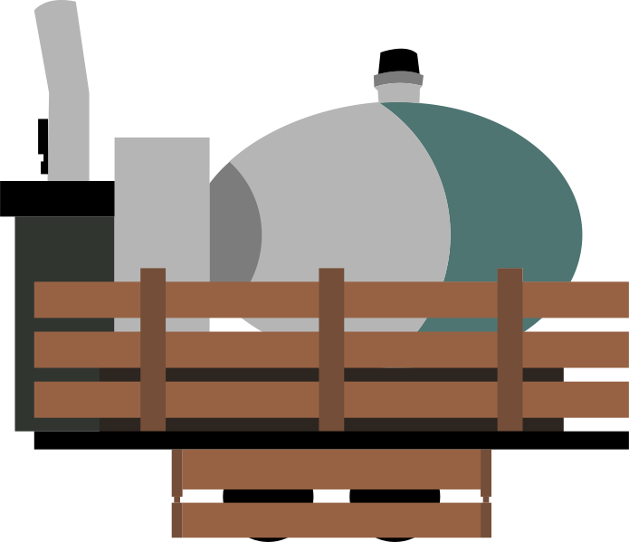

  

<h1 align="center">payload.tf</h1>

Payload's React dashboard

    

# Description

payload.tf is the React site for the payload-neo Discord bot. All functionality for frontend will be in this repo.

# Issues, Questions

Any issues or questions should be posted on GitHub issues, where they can be more easily tracked. Feature requests are welcome!

# Support this Project

You may back me on my [Patreon](https://www.patreon.com/c43721). Direct sponsorship of this project can be discussed on Discord (24#7644) or by another medium.

# Contributing

Before contributing, please make sure no one else has stated against your proposal. Otherwise, make a Pull Request detailing your proposal and any relevant code changes. If you are committing code, try to create test cases, as going foward we'd like to have stable tests. Also, you should take a look at our [Contributing guide](CONTRIBUTING)

## Acknowledgements

Thank you to the Vercel team for helping with covering costs for payload-neo's website.

# License

This project is [MIT licensed](LICENSE).
